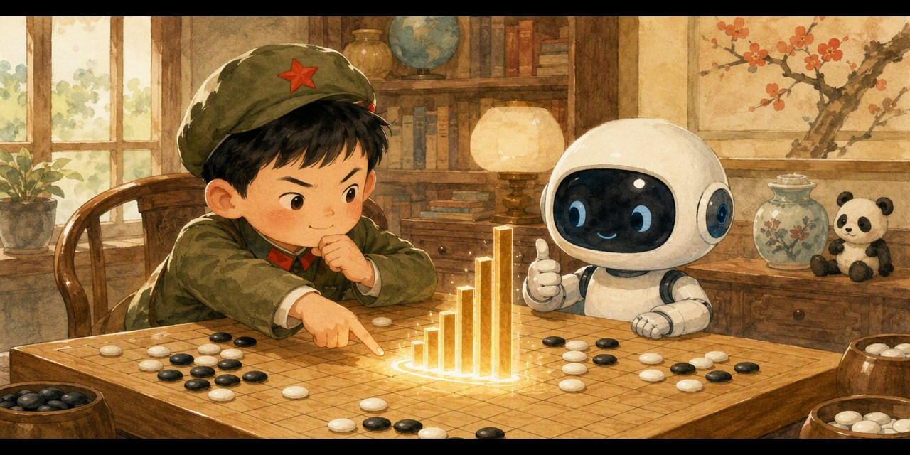

# 胜率指挥官 · 帮 AlphaGo 想下一步（Go Commander）

> 不背棋谱，不靠运气，每一步都算赢面——把 AlphaGo 变成孩子的决策游戏。

## 这是什么？

「和孩子一起学AI」社群 **AI十哲系列 · 第六课** 的配套游戏，把 2016 年震惊世界的 **AlphaGo** 变成孩子能上手玩的胜率判断挑战：

- 🤖 **AlphaGo** 摆出棋局，给出 A、B、C 三个候选落点
- 🪖 **指挥官（就是你）**：像 AlphaGo 一样思考，选出赢面最大的那一点
- 📊 每次选择后公布三个点的真实胜率——亲眼看到「最爽的走法 ≠ 最好的走法」

## 怎么玩？

1. 双击打开 `index.html`（手机、电脑都行，无需联网）
2. 看棋盘局面，点你选中的候选点
3. 三大关卡层层升级：

- ⚫ **直觉陷阱**：吃掉一颗子很爽，但赢面最大的另有其点
- ⚪ **算深一步**：三个候选点只差几个百分点，安安静静的那步才是好棋
- 🏆 **神之一手**：致敬第 37 手——最不起眼的角落藏着最高赢面

4. 集齐三枚徽章 ⚫⚪🏆，领取「**AlphaGo 金牌指挥官证书**」，截图发群里领奖状！

## 教育目标

- 理解 AlphaGo 的核心机制：**每个候选都算胜率，选赢面最大的**（蒙特卡洛树搜索 + 深度学习的儿童版表达）
- 迁移到学习：错题本 = 左右互搏（自我对弈），考试检查 = 重新算一遍赢面
- 决策启蒙：不选最喜欢的，选赢面最大的；敢走别人没走过的「第 37 手」

## AI十哲系列游戏

| 课次 | 论文 | 游戏 | 仓库 |
| --- | --- | --- | --- |
| 第一课 | 感知机（1957） | 人类还是AI | [human-or-ai](https://github.com/pulj26pulj26/human-or-ai) |
| 第二课 | 图像识别 | 苹果还是不是苹果 | [apple-or-not](https://github.com/pulj26pulj26/apple-or-not) |
| 第三课 | LSTM（1997） | 记忆特工队·小本本大冒险 | [memory-agent](https://github.com/pulj26pulj26/memory-agent) |
| 第四课 | ResNet（2015） | 高速公路工程师·帮AI盖大楼 | [ai-highway](https://github.com/pulj26pulj26/ai-highway) |
| 第五课 | GAN（2014） | 真假画廊·小评委大挑战 | [spot-the-fake](https://github.com/pulj26pulj26/spot-the-fake) |
| 第六课 | AlphaGo（2016） | 胜率指挥官·帮AlphaGo想下一步 | **go-commander（本仓库）** |

## 本地运行

无需安装任何东西，双击 `index.html` 即可运行。也可以访问在线版：

**https://pulj26pulj26.github.io/go-commander/**

---

Made with ❤️ by 和孩子一起学AI
